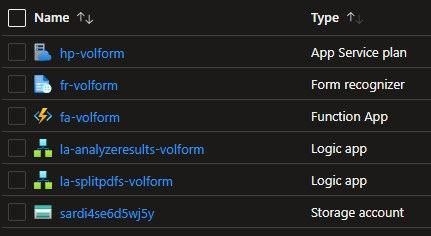

# Implementing this Solution

## Deploy Resources to Azure

To implement this solution, go to the following GitHub repository and/or click the "Deploy to Azure" button.

 

[stevedem/FormRecognizerAccelerator (github.com)](https://github.com/stevedem/FormRecognizerAccelerator)

After clicking Deploy to Azure, you will be asked to fill out the following fields:

Once the deployment succeeds, you should see six resources in your resource group.

Please note that this will only deploy the core infrastructure. There are a few steps to configure each service once deployed.

 

Each configuration is divided into these sections:

 

- **Storage Account** - create containers & upload data
- **Form Recognizer** - train custom document model
- Function App - deploy open-source Python code to split PDFs
- **Split PDFs Logic App** - split multi-page PDF documents to single-page PDF documents
- **Analyze Results Logic App** - send single-page PDF document data to REST API endpoint of trained custom document model

## Next Steps

[Implement this Solution - Storage Account - create containers & upload data](02-storage-account-containers-upload-data.md)