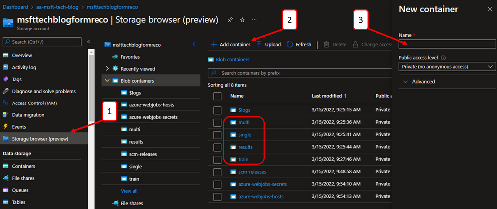
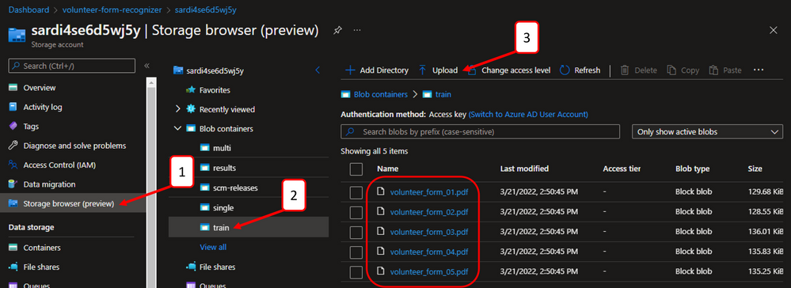

# Implement this Solution

## Storage Account - create containers & upload data

Navigate to the storage account that was created during resource deployment.

1. Click Storage browser (preview)
2. Click + Add container
3. Enter "train" as the container name
4. Repeat for the following containers: multi, single, results

Next, upload the training data. Download all five PDF files under the "train" folder of this GitHub repository: https://aka.ms/form-reco-sample

 

Then, navigate to the storage account that was created during resource deployment to upload these five PDF files.

1. Click Storage browser (preview)
2. Select the "train" container
3. Click Upload
4. Select all five training documents from the provided sample data (download sample data here: http://aka.ms/form-reco-sample)
 

Before continuing to the next section, please follow the steps to Configure CORS (Cross Origin Resource Sharing) on your storage account. This is required to be enabled on your storage account for it to be accessible from the Form Recognizer Studio. A detailed walkthrough can be found here: [Configure CORS | Microsoft Docs](https://docs.microsoft.com/en-us/azure/applied-ai-services/form-recognizer/quickstarts/try-v3-form-recognizer-studio#configure-cors)

## Next Steps

[Form Recognizer - Train Custom Model](03-form-recognizer-train-custom-model.md)