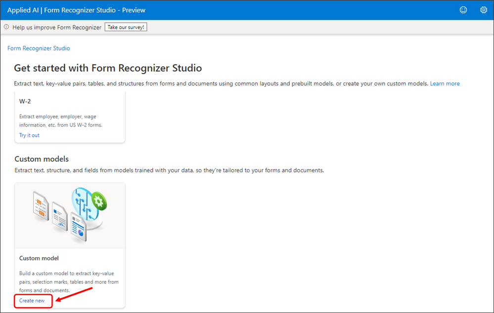
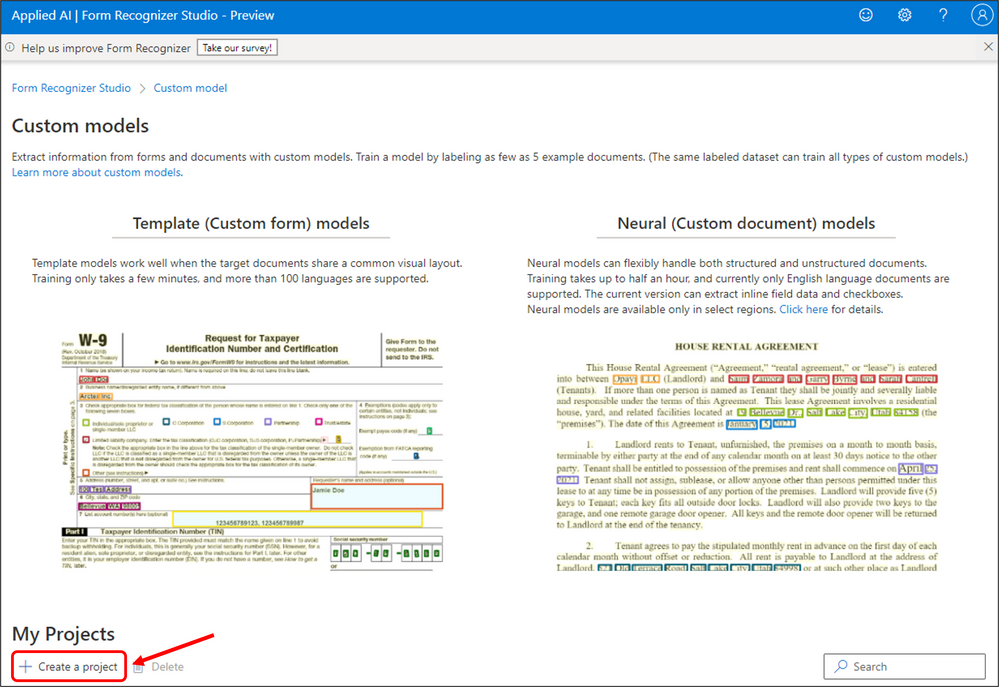
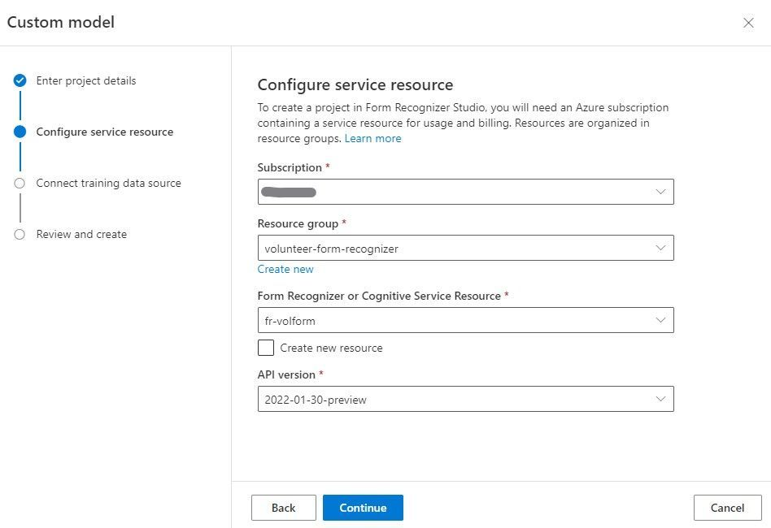
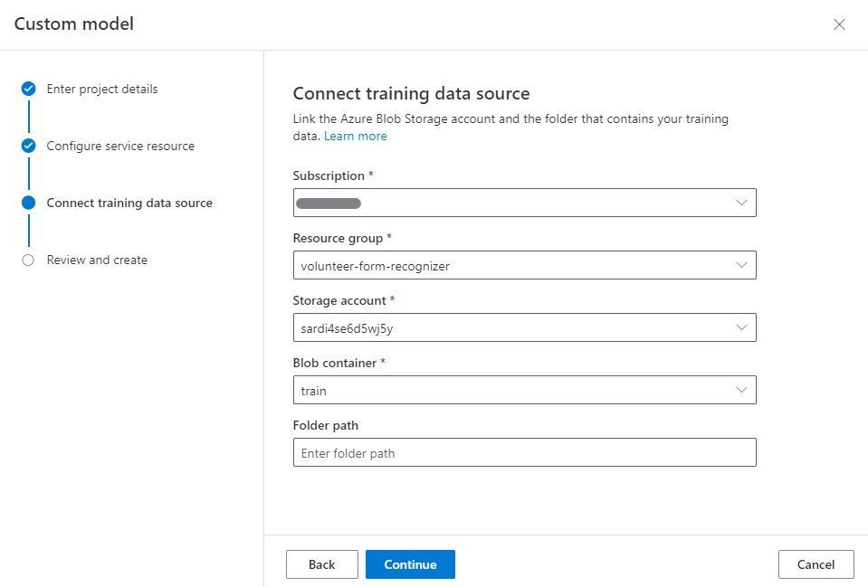
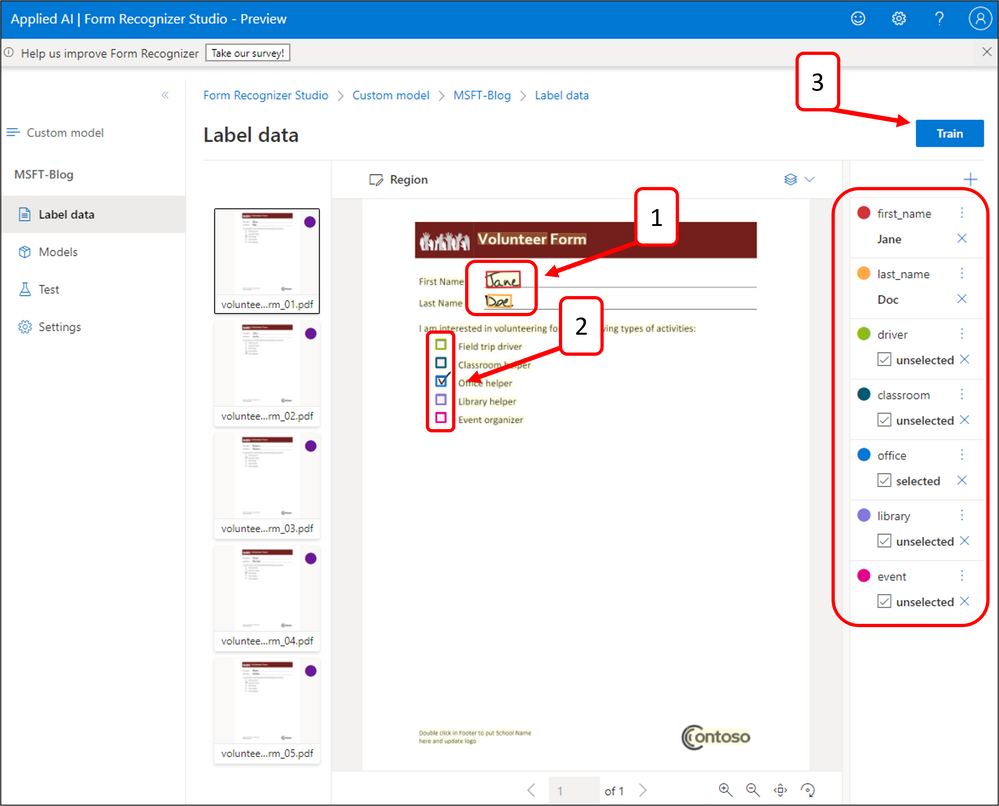
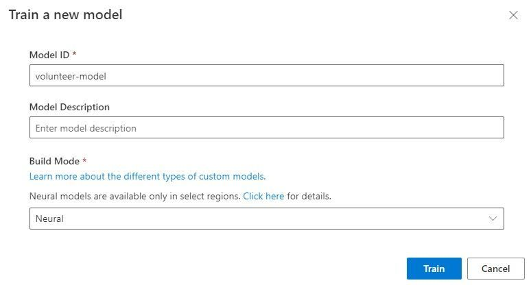

# Implement this Solution

## Form Recognizer - train custom document model

Navigate to the Form Recognizer Studio: FormRecognizerStudio (azure.com)

- Scroll down and click Create new Custom model.

- Scroll down and click + Create a project, enter project name and click Continue.

- Configure service resources by selecting the resource group and form recognizer service that was created during resource deployment. Then click Continue.
 

- Connect training data source by selecting the resource group, storage account and train container that was created during resource deployment. Then click Continue.

- Finally, review all configurations and finish creating the project.
  

Once your project is open and you can see all five training documents, label and train a custom document model by following these steps.

1. Create two field labels for the first name and last name of the Volunteer Form.
2. Create six selection marks labels for each volunteer activity.
3. Repeat for all five training documents, then click Train.

- Enter a Model ID and keep a note of the Model ID value (you need it later). Set the Build Mode to Neural and click Train.

## Next Steps

[Function App - deploy open-source Python code to split PDFs](04-deploy-function-app-to-split-pdfs.md)