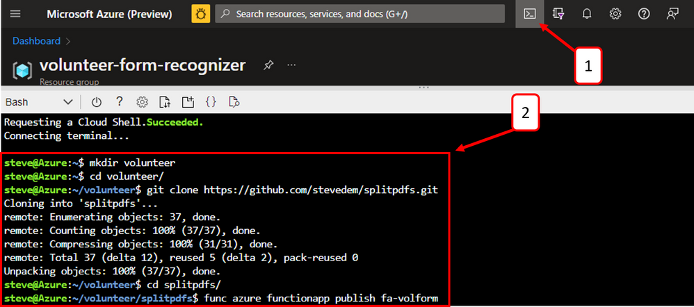
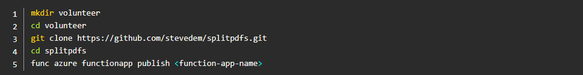

# Implement this Solution

## Function App - deploy open-source Python code to split PDFs

Next step is to deploy the open-source Python code to split PDFs as an Azure Function.

 

1. Navigate to the Azure Portal and open up an Azure Cloud Shell session by clicking the icon at the top of the screen.
2. Enter the following commands to clone the GitHub repository and publish the Azure Function, replacing the \<function-app-name> with the name of your Function App resource deployed during resource deployment.

After the command to publish the function has successfully completed, here is an example of the output.

## Next Steps

[Split PDFs Logic App - split multi-page PDF documents to single-page PDF documents](05-split-pdfs-logic-app.md)