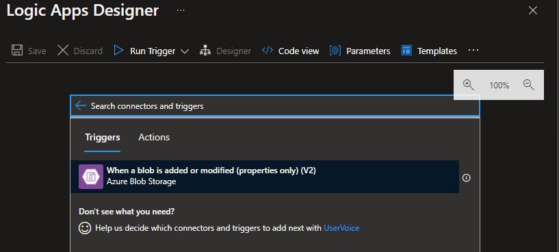
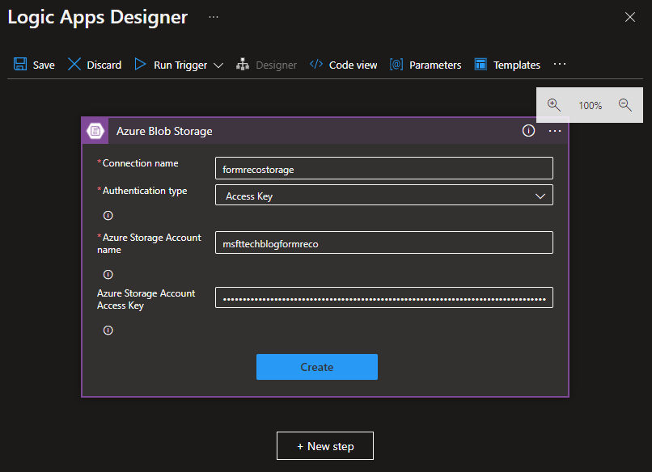
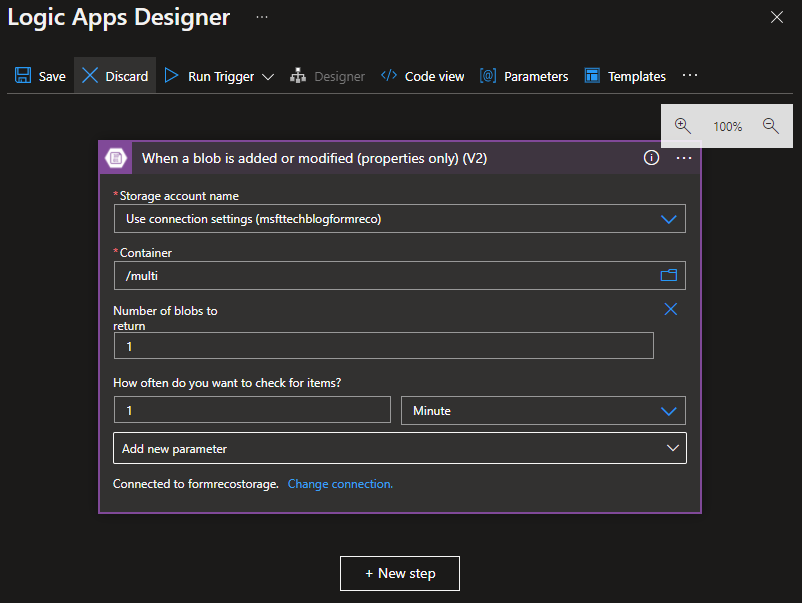
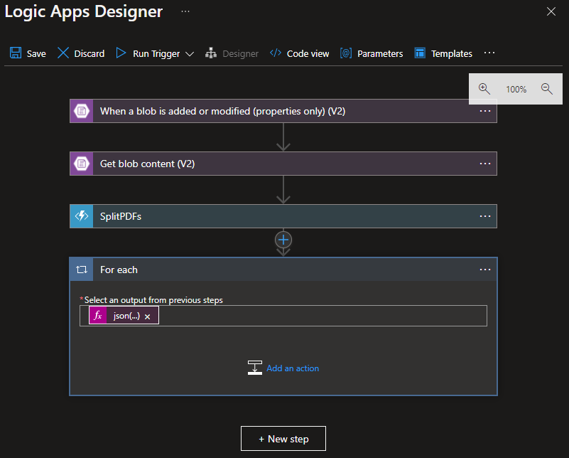
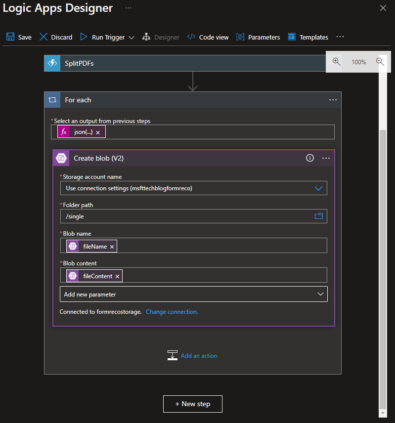
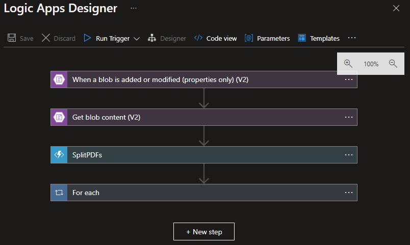

# Implement this Solution

## Split PDFs Logic App - split multi-page PDF documents to single-page PDF documents

Next up is to build out the Logic App, which will call the Function App we just published.

1. Add the **Azure Blob Storage** trigger When a blob is added or modified (properties only) (V2)

2. Create a connection to the storage account created during resource deployment. You will need to retrieve the storage account access key. If you need help finding your access key, please refer to this documentation: [Manage account access keys - Azure Storage | Microsoft Docs](https://docs.microsoft.com/en-us/azure/storage/common/storage-account-keys-manage?tabs=azure-portal#view-account-access-keys)

3. Select the connection you previously created and specify the following settings:

|Property|Setting|
|------|-----|
|Container	|/multi|
|Number of blobs to return|1|
|How often do you want to check for items|1 Minute |

4. Add a new step: **Get blob content (V2)** with the following settings

|Property|Setting|
|---|---|
|Storage account name |	Use connection settings|
|Blob |	List of Files Path (Dynamic Expression)|
|Infer content type	| Yes |

5. Add a new step: **Azure Function** with the following settings

Request Body:

    {
        "fileContent": "@body('Get_blob_content_(V2)')",
        "fileName": "@triggerBody()?['DisplayName']"
    }

6. Add a new step: **Control: For each** with the following settings:

|Property|Setting|
|---|---|
|Select an output from previous steps |	@json(body('SplitPDFs'))['individualPDFs']|

7. 
Add an action: **Create blob (V2)** with the following settings:

|Property|Setting|
|---|---|
|Folder path	|/single|
|Blob name	| @{items('For_each')?['fileName']}|
|Blob content | @base64ToBinary(items('For_each')?['fileContent'])|

8. Click Save. Your Logic App should now look like this:

## Next Steps

[Analyze Results Logic App - send single-page PDF document data to REST API endpoint of trained custom document model](06-analyze-results-logic-app.md)