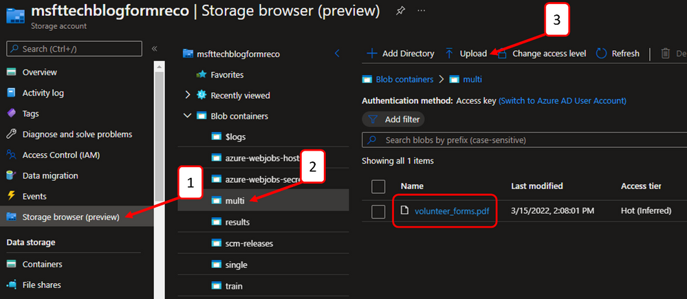
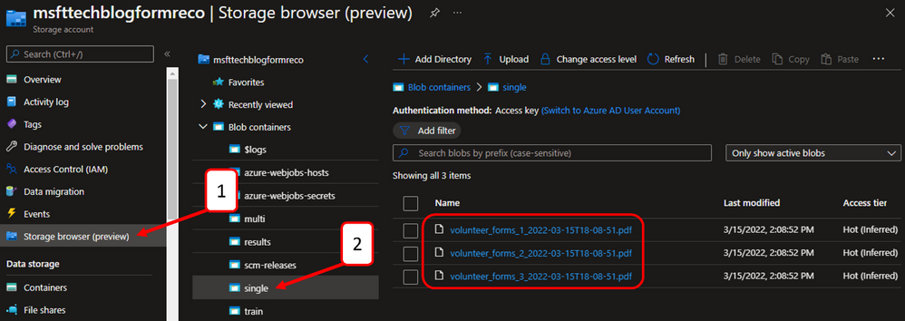
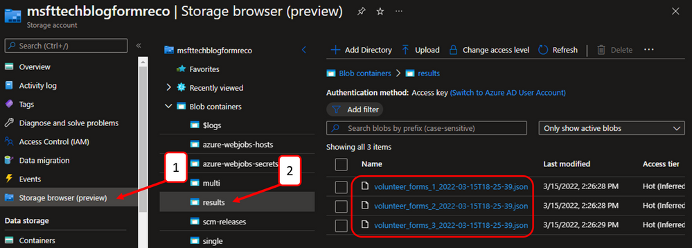
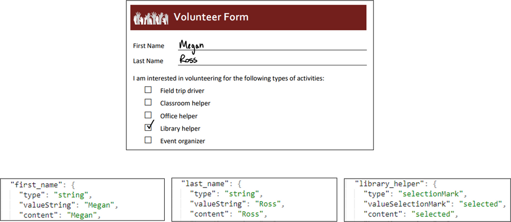

# Implement this Solution

## Verifying the Functionality

Navigate to the storage account created during resource deployment.

1. Click storage browser
2. Click the “multi” blob container
3. Click the “Upload” button to select a multi-page PDF to upload

Wait a few minutes and check the status of the first Logic App, responsible for splitting PDFs. Then, navigate to the storage account deployed as part of the prerequisites.

 

1. Click the storage browser
2. Click the “single” blob container
3. Verify that each page of the multi-page PDF was saved as an individual file

Wait a few minutes and check the status of the second Logic App, responsible for analyzing results from single-page PDFs. Then, navigate to the storage account deployed as part of the prerequisites.

 

1. Click the storage browser
2. Click the “results” blob container
3. Verify that each single-page PDF file has a corresponding JSON file with the custom document model output 

After downloading and inspecting the volunteer form and corresponding JSON output, we can quickly see that our data was efficiently and accurately extracted using our Form Recognizer custom document model.

## Conclusion
 

In just a few steps we created an AI model and an orchestration pipeline. Now you can leverage this solution to extract valuable data from your multi-page PDF forms. You can check out the GitHub repository here, where this solution accelerator is hosted. In future iterations, we hope to further automate the deployment and configuration tasks.

[stevedem/FormRecognizerAccelerator (github.com)](https://github.com/stevedem/FormRecognizerAccelerator)