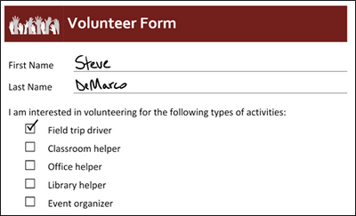
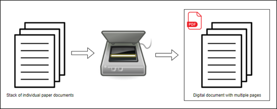
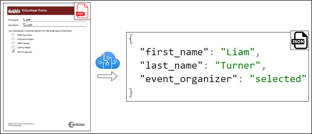
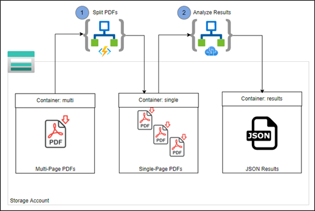

# Form Recognizer Solution Accelerator

The Form Recognizer Cognitive Service helps you quickly extract text and structure from documents. Custom document models can be trained to understand the specific structure and fields within your documents and extract valuable data. You can quickly train a custom document model that performs very well for your unique forms. Incorporating that model into an automated solution will be the focus of this article.

 

This solution implements two capabilities that are commonly required when working with a trained custom document model:

 

1. Splitting multi-page PDF documents into individual, single-page PDF documents
2. Analyzing the results of documents sent to the Form Recognizer REST API endpoint of a trained custom document model
 

These capabilities are linked together in a cohesive solution using a pair of Logic Apps and an Azure Function.

 

It is important to note that my reference to the multi-page PDF document contains multiple pages of the same form. In other words, the form layout and structure on Page 1 is identical to the form layout and structure on Page 2 (and so on). Each form is only one page in length.

 

In our fictitious demonstration scenario, we will be working with Volunteer Forms which contain custom fields for first name and last name as well as selection marks for each volunteer activity. Below is a screenshot of what the forms look like.

You can download all sample data here: https://aka.ms/form-reco-sample

 

There are two folders in the GitHub repository linked above:

 

1. **train** – contains five individual PDF files (which you can use to train a custom document model in Form Recognizer)
2. **test** – contains a single multi-page PDF file with four pages of filled out forms

## Splitting PDFs
 

Often, when you work with paper-based documents, scanning multiple pages into a single document is the most reasonable way to efficiently digitize these valuable documents. However, documents are required to be a single page when retrieving results from the API endpoint of a trained custom document model. This solution uses an Azure Function with open-source Python code to read the content of a multi-page PDF file and split it into individual, single-page PDF files. Wrapping this Azure Function in a Logic App provides you with the ability to easily trigger the Logic App whenever a new file is uploaded to a storage account and write each of the single-page PDF files to a storage account.

## Analyzing Results
 

The Form Recognizer service makes training a custom document model very easy. Once the model has completed training, it is immediately published and available to consume as a REST API endpoint. You can extract results from documents by sending the document data to the REST API endpoint which hosts your custom document model. Incorporating this machine learning model into an efficient and scalable solution can sometimes be challenging. This solution uses a Logic App to send single-page PDF document data to the published REST API endpoint of a trained custom document model and stores the resulting JSON data into a JSON file in a storage account.

## Bringing it all Together
 

In our fictitious Volunteer Form example, let's say that we filled out a few sample, single-page PDF documents to train a Form Recognizer custom document model. We want to extract the key fields: first name, last name, and each selection mark for volunteer activity. Once we have a model trained, blank forms were distributed to employees to fill out. Once all forms were filled out and gathered, they were placed into a digital scanner as a single stack of documents. The resulting multi-page PDF file has individual pages for each employee's form. To quickly extract the data from this form, we can upload the data to the "multi" container of our storage account and, in a few minutes, have the extracted data from each form.

 

In the architecture below, this solution can be fully automated once a multi-page PDF file is uploaded to a storage account container.

There are four containers in a storage account:

 

1. **train** - intended for storing the training data for Form Recognizer
2. **multi** - intended for storing multi-page PDF documents
3. **single** - intended for storing single-page PDF documents
4. **results** - which will contain the JSON results from the Form Recognizer API
 

There are two Logic Apps:

 

1. **Split PDFs** - which splits multi-page PDFs to single-page PDFs
2. **Analyze Results** - which sends single-page PDF data to the Form Recognizer API and stores the results of the trained custom document model to a JSON file in the “results” container.

The first Logic App is triggered when a multi-page PDF file is created in the “multi” container in a storage account. From there, the Logic App will send the PDF document to an Azure Function, which individually splits out each page in the document. The Azure Function returns the PDF data back to the Logic App, which then writes each single-page PDF document back to another container in the same storage account (single).

 

From here, another Logic App triggers whenever a single-page PDF file is created in the “single” container. This Logic App sends the PDF data to the REST API endpoint of your trained custom document model. The results of the API call are returned and stored as JSON. The data in the JSON document contains your custom form fields and selection marks.